# Sistem Manajemen TOGA (Tanaman Obat Keluarga)

> **Tugas UTS – Pemrograman Berorientasi Objek**

| Info | Detail               |
|------|----------------------|
| **Nama** | Nabilah Alfa Rahmah  |
| **NIM** | 2409106004           |
| **Kelas** | A 2024 – Informatika |
 
---

## Deskripsi Program

Sistem Manajemen TOGA adalah aplikasi berbasis konsol (CLI) yang dibangun menggunakan **Java** dengan paradigma **Pemrograman Berorientasi Objek (OOP)**. Program ini mengelola data tanaman obat keluarga (TOGA), data pengguna, dan catatan penanaman secara digital dan terstruktur.

Program menerapkan **7 konsep OOP** yang disyaratkan:

| No | Konsep |
|----|--------|
| 1 | Perulangan (while, do-while, for, for-each) |
| 2 | Percabangan if / else if / else |
| 3 | Percabangan switch-case |
| 4 | Enkapsulasi |
| 5 | Inheritance |
| 6 | Polimorfisme – Overriding |
| 7 | Polimorfisme – Overloading |
 
---

## Struktur Package & Class

```
src/
└── com/toga/
    ├── Main.java                  ← Entry point & menu interaktif
    └── model/
        ├── Tanaman.java           ← Superclass (induk)
        ├── TanamanRempah.java     ← Subclass: tanaman rempah
        ├── TanamanDaun.java       ← Subclass: tanaman daun
        ├── TanamanBuah.java       ← Subclass: tanaman buah
        ├── Pengguna.java          ← Kelas mandiri: data pengguna
        └── Catatan.java           ← Kelas mandiri: catatan tanam
```

**Diagram Hierarki Inheritance:**

```
        Tanaman  (abstract superclass)
       /        |        \
TanamanRempah  TanamanDaun  TanamanBuah
(+ aroma)   (+ bentukDaun) (+ musimBerbuah)
```
 
---

## Fitur Utama

| Menu | Sub-Fitur |
|------|-----------|
| **Kelola Tanaman** | Tambah (Rempah/Daun/Buah), Lihat tabel, Ubah, Hapus, Statistik per jenis, Estimasi panen |
| **Kelola Pengguna** | Tambah, Lihat tabel, Ubah, Hapus |
| **Kelola Catatan** | Tambah (hubungkan pengguna+tanaman), Lihat, Ubah keterangan, Hapus |
 
---

## Implementasi Konsep OOP

### 1. Perulangan (Loop)

Program menggunakan **3 jenis** perulangan:

**A. `do-while` — Navigasi semua menu**
```
java
// Main.java — menu utama
do {
    tampilMenuUtama();
    pilihan = sc.nextInt();
    sc.nextLine();
    switch (pilihan) { ... }
} while (pilihan != 0);
```

**B. `for` (indeks) — Menampilkan tabel dengan nomor urut**
```
java
// Main.java — tampilTabelTanaman()
for (int i = 0; i < list.size(); i++) {
    Tanaman t = list.get(i);
    System.out.printf(fmt + "%n",
        i + 1,
        potong(t.getNama(), 18),
        potong(t.getNamaLatin(), 16),
        potong(t.getJenis(), 14),
        potong(t.getManfaat(), 20));
}
```

**C. `for-each` — Iterasi koleksi ArrayList**
```
java
// Main.java — tampilEstimasi()
for (Tanaman t : list) {
    int hari  = t.estimasiHariPanen(tujuan);
    int bulan = hari / 30;
    int sisa  = hari % 30;
    System.out.printf(fmt + "%n",
        potong(t.getNama(), 18),
        potong(t.getJenis(), 14),
        hari + " hr",
        bulan + " bln " + sisa + " hr");
}
```
 
---

### 2. Percabangan if / else if / else

**A. Validasi di setter — `Pengguna.java`**
```
java
public boolean setNama(String nama) {
    if (StringUtils.isBlank(nama)) {
        System.out.println("Nama tidak boleh kosong.");
        return false;
    } else {
        this.nama = nama;
        return true;
    }
}
```

**B. Validasi setter — `TanamanBuah.java`**
```
java
public boolean setMusimBerbuah(String musimBerbuah) {
    if (StringUtils.isBlank(musimBerbuah)) {
        System.out.println("Musim berbuah tidak boleh kosong.");
        return false;
    } else {
        this.musimBerbuah = musimBerbuah;
        return true;
    }
}
```

**C. Logika kondisional multi-cabang — `Main.java`**
```
java
// Penentuan tujuan panen
if (pilihTujuan == 2)      tujuan = "obat";
else if (pilihTujuan == 3) tujuan = "bibit";
else                       tujuan = "konsumsi";
```

**D. Deteksi tipe objek dengan `instanceof` — `Main.java`**
```
java
if (t instanceof TanamanRempah) {
    TanamanRempah tr = (TanamanRempah) t;
    System.out.print("  Aroma         : ");
    while (!tr.setAroma(sc.nextLine()))
        System.out.print("  Aroma         : ");
} else if (t instanceof TanamanDaun) {
    TanamanDaun td = (TanamanDaun) t;
    System.out.print("  Bentuk Daun   : ");
    while (!td.setBentukDaun(sc.nextLine()))
        System.out.print("  Bentuk Daun   : ");
} else if (t instanceof TanamanBuah) {
    TanamanBuah tb = (TanamanBuah) t;
    System.out.print("  Musim Berbuah : ");
    while (!tb.setMusimBerbuah(sc.nextLine()))
        System.out.print("  Musim Berbuah : ");
}
```
 
---

### 3. Percabangan switch-case

**A. Menu utama — `Main.java`**
```
java
switch (pilihan) {
    case 1: /* Kelola Tanaman */  break;
    case 2: /* Kelola Pengguna */ break;
    case 3: /* Kelola Catatan */  break;
    case 0: break;
    default:
        pesanError("Pilihan tidak valid.");
        break;
}
```

**B. Sub-menu pilih jenis tanaman — `Main.java`**
```

switch (jenis) {
    case 1:
        daftarTanaman.add(new TanamanRempah(nama, namaLatin, manfaat, aroma));
        pesanOk("Tanaman Rempah berhasil ditambahkan!");
        break;
    case 2:
        daftarTanaman.add(new TanamanDaun(nama, namaLatin, manfaat, bentukDaun));
        pesanOk("Tanaman Daun berhasil ditambahkan!");
        break;
    case 3:
        daftarTanaman.add(new TanamanBuah(nama, namaLatin, manfaat, musimBerbuah));
        pesanOk("Tanaman Buah berhasil ditambahkan!");
        break;
    default:
        pesanError("Jenis tidak valid.");
        break;
}
```
 
---

### 4. Enkapsulasi (Encapsulation)

Enkapsulasi adalah prinsip menyembunyikan data internal objek dan mengontrol aksesnya dari luar. Java menyediakan **4 access modifier** untuk mengatur tingkat akses:
 
---

#### A. `private` — Hanya bisa diakses di dalam kelas itu sendiri

Digunakan untuk semua **atribut/field** agar tidak bisa diakses atau diubah langsung dari luar kelas.

``` java
// Pengguna.java
public class Pengguna {
    private String nama;    // tidak bisa diakses dari luar: p.nama = "..."
    private String alamat;  // harus lewat setter: p.setNama("...")
}
 
// TanamanBuah.java
public class TanamanBuah extends Tanaman {
    private String musimBerbuah; // private — bahkan subclass pun tidak bisa akses langsung
}
 
// TanamanDaun.java
public class TanamanDaun extends Tanaman {
    private String bentukDaun;   // hanya bisa diakses dalam TanamanDaun itu sendiri
}
 
// TanamanRempah.java
public class TanamanRempah extends Tanaman {
    private String aroma;        // dilindungi sepenuhnya dari akses luar
}
 
// Catatan.java
public class Catatan {
    private final String namaPengguna; // private + final = tidak bisa diubah setelah dibuat
    private final String namaTanaman;
    private String keterangan;         // private, tapi bisa diubah via setter
}
```
 
---

#### B. `public` — Bisa diakses dari mana saja

Digunakan untuk **getter, setter, constructor, dan method** yang memang perlu diakses dari luar kelas.

``` java
// Pengguna.java — getter public: boleh dibaca dari mana saja
public String getNama()   { return nama; }
public String getAlamat() { return alamat; }
 
// setter public: boleh dipanggil dari mana saja, tapi tetap ada validasi
public boolean setNama(String nama) {
    if (StringUtils.isBlank(nama)) {
        System.out.println("Nama tidak boleh kosong.");
        return false;
    }
    this.nama = nama;
    return true;
}
 
// TanamanBuah.java — method public bisa dipanggil dari Main.java
public String getMusimBerbuah() { return musimBerbuah; }
 
public boolean setMusimBerbuah(String musimBerbuah) {
    if (StringUtils.isBlank(musimBerbuah)) {
        System.out.println("Musim berbuah tidak boleh kosong.");
        return false;
    }
    this.musimBerbuah = musimBerbuah;
    return true;
}
 
// TanamanDaun.java
public String getBentukDaun() { return bentukDaun; }
 
public boolean setBentukDaun(String bentukDaun) {
    if (StringUtils.isBlank(bentukDaun)) {
        System.out.println("Bentuk daun tidak boleh kosong.");
        return false;
    }
    this.bentukDaun = bentukDaun;
    return true;
}
 
// TanamanRempah.java
public String getAroma() { return aroma; }
 
public boolean setAroma(String aroma) {
    if (StringUtils.isBlank(aroma)) {
        System.out.println("Aroma tidak boleh kosong.");
        return false;
    }
    this.aroma = aroma;
    return true;
}
 
// Catatan.java
public String getNamaPengguna() { return namaPengguna; }
public String getNamaTanaman()  { return namaTanaman; }
public String getKeterangan()   { return keterangan; }
 
public boolean setKeterangan(String keterangan) {
    if (StringUtils.isBlank(keterangan)) {
        System.out.println("Keterangan tidak boleh kosong.");
        return false;
    }
    this.keterangan = keterangan;
    return true;
}
 
// tampilInfo() public — bisa dipanggil dari Main.java
public void tampilInfo() {
    System.out.println("Nama    : " + getNama());
    System.out.println("Alamat  : " + getAlamat());
}
```
 
---

#### C. `protected` — Bisa diakses di kelas sendiri, package yang sama, dan subclass

Digunakan untuk **atribut di superclass `Tanaman`** yang perlu diakses langsung oleh subclass-nya (`TanamanBuah`, `TanamanDaun`, `TanamanRempah`).

``` java
// Tanaman.java (superclass)
public abstract class Tanaman {
    protected String nama;       // bisa diakses langsung oleh TanamanBuah, TanamanDaun, TanamanRempah
    protected String namaLatin;  // karena mereka adalah subclass dari Tanaman
    protected String manfaat;    // tidak bisa diakses dari Main.java (beda package, bukan subclass)
}
 
// TanamanBuah.java — subclass bisa akses atribut protected milik superclass
public class TanamanBuah extends Tanaman {
    @Override
    String getInfoSingkat() {
        return nama + " (" + getNamaLatin() + ") - Buah";
        //     ^^^^ langsung pakai 'nama' tanpa getter, karena protected
    }
}
 
// TanamanDaun.java
public class TanamanDaun extends Tanaman {
    @Override
    String getInfoSingkat() {
        return nama + " (" + getNamaLatin() + ") - Daun";
        //     ^^^^ akses protected dari superclass
    }
}
 
// TanamanRempah.java
public class TanamanRempah extends Tanaman {
    @Override
    String getInfoSingkat() {
        return nama + " (" + getNamaLatin() + ") - Rempah";
        //     ^^^^ akses protected dari superclass
    }
}
```
 
---

#### D. `default` (Package-Private) — Hanya bisa diakses dalam package yang sama

Tidak ada keyword, cukup tidak ditulis modifier-nya. Digunakan untuk method yang hanya boleh dipakai antar kelas dalam satu package `com.toga.model`, tidak boleh diakses dari `com.toga.Main`.

``` java
// Pengguna.java — method default, tanpa access modifier
String getInfoSingkat() {                    // bisa dipanggil dari Catatan.java (package sama)
    return nama + " - " + alamat;            // tidak bisa dipanggil dari Main.java (beda package)
}
 
// Catatan.java — buatRingkasan() memanggil getInfoSingkat() yang default
public String buatRingkasan(Tanaman t, Pengguna p) {
    return "Catatan: " + p.getInfoSingkat()  // boleh, Catatan.java satu package dengan Pengguna.java
           + " menanam " + t.getInfoSingkat();
}
 
// TanamanBuah.java — getInfoSingkat() juga default
@Override
String getInfoSingkat() {                    // bisa dipakai dalam package com.toga.model
    return nama + " (" + getNamaLatin() + ") - Buah";
}
 
// TanamanDaun.java
@Override
String getInfoSingkat() {
    return nama + " (" + getNamaLatin() + ") - Daun";
}
 
// TanamanRempah.java
@Override
String getInfoSingkat() {
    return nama + " (" + getNamaLatin() + ") - Rempah";
}
```
 
---

#### Ringkasan Penggunaan di Project Ini

| Modifier | Digunakan pada | Contoh |
|----------|---------------|--------|
| `private` | Semua field/atribut di semua kelas | `private String nama`, `private String aroma` |
| `public` | Constructor, getter, setter, tampilInfo() | `public String getNama()`, `public boolean setNama()` |
| `protected` | Atribut superclass `Tanaman` yang dipakai subclass | `protected String nama` di `Tanaman.java` |
| `default` | Method internal antar kelas satu package | `String getInfoSingkat()` di `Pengguna.java`, semua kelas model |
 
---

### 5. Inheritance (Pewarisan)

`Tanaman` sebagai superclass diwarisi oleh tiga subclass menggunakan `extends`. Setiap subclass memanggil `super()` di constructor untuk menginisialisasi atribut induk.

**`TanamanBuah.java`**
``` java
public class TanamanBuah extends Tanaman {   // extends = pewarisan
    private String musimBerbuah;             // atribut tambahan milik subclass
 
    public TanamanBuah(String nama, String namaLatin,
                       String manfaat, String musimBerbuah) {
        super(nama, namaLatin, manfaat);     // panggil constructor superclass
        this.musimBerbuah = musimBerbuah;
    }
}
```

**`TanamanDaun.java`**
``` java
public class TanamanDaun extends Tanaman {
    private String bentukDaun;
 
    public TanamanDaun(String nama, String namaLatin,
                       String manfaat, String bentukDaun) {
        super(nama, namaLatin, manfaat);
        this.bentukDaun = bentukDaun;
    }
}
```

**`TanamanRempah.java`**
``` java
public class TanamanRempah extends Tanaman {
    private String aroma;
 
    public TanamanRempah(String nama, String namaLatin,
                         String manfaat, String aroma) {
        super(nama, namaLatin, manfaat);
        this.aroma = aroma;
    }
}
```
 
---

### 6. Polimorfisme — Method Overriding

Setiap subclass mengimplementasikan ulang method dari superclass menggunakan `@Override`.

**`getJenis()` — berbeda di tiap subclass**
``` java
// TanamanBuah.java
@Override
public String getJenis() { return "Tanaman Buah"; }
 
// TanamanDaun.java
@Override
public String getJenis() { return "Tanaman Daun"; }
 
// TanamanRempah.java
@Override
public String getJenis() { return "Tanaman Rempah"; }
```

**`estimasiHariPanen()` — nilai berbeda sesuai jenis**
``` java
// TanamanBuah.java
@Override
public int estimasiHariPanen() { return 180; }   // 6 bulan
 
// TanamanDaun.java
@Override
public int estimasiHariPanen() { return 60; }    // 2 bulan
 
// TanamanRempah.java
@Override
public int estimasiHariPanen() { return 240; }   // 8 bulan
```

**`tampilInfo()` — output berbeda sesuai jenis**
``` java
// TanamanBuah.java
@Override
public void tampilInfo() {
    super.tampilInfo();   // panggil method induk dulu
    System.out.println("Jenis         : Tanaman Buah");
    System.out.println("Musim Berbuah : " + getMusimBerbuah());
}
 
// TanamanDaun.java
@Override
public void tampilInfo() {
    super.tampilInfo();
    System.out.println("Jenis       : Tanaman Daun");
    System.out.println("Bentuk Daun : " + getBentukDaun());
}
 
// TanamanRempah.java
@Override
public void tampilInfo() {
    super.tampilInfo();
    System.out.println("Jenis       : Tanaman Rempah");
    System.out.println("Aroma       : " + getAroma());
}
```
 
---

### 7. Polimorfisme — Method Overloading

Method dengan nama sama tetapi jumlah/tipe parameter berbeda.

**`hitungTanaman()` — di class `Tanaman`**
``` java
// Tanpa parameter: hitung semua tanaman
public static int hitungTanaman(ArrayList<Tanaman> list) {
    return list.size();
}
 
// Dengan parameter jenis: hitung per kategori
public static int hitungTanaman(ArrayList<Tanaman> list, String jenis) {
    int count = 0;
    for (Tanaman t : list)
        if (t.getJenis().equals(jenis)) count++;
    return count;
}
```

**`estimasiHariPanen()` — di class `Tanaman`**
``` java
// Tanpa parameter: estimasi default (di-override tiap subclass)
public int estimasiHariPanen() { ... }
 
// Dengan parameter tujuan: estimasi disesuaikan tujuan panen
public int estimasiHariPanen(String tujuan) {
    int base = estimasiHariPanen();
    switch (tujuan) {
        case "obat":  return (int)(base * 1.2); // lebih lama, senyawa maksimal
        case "bibit": return (int)(base * 1.5); // terlama, untuk kualitas bibit
        default:      return base;              // konsumsi = standar
    }
}
```

**Penggunaan di `Main.java`:**
``` java
// Memanggil dua versi hitungTanaman()
System.out.printf(fmt + "%n", "Semua Tanaman",  Tanaman.hitungTanaman(list));
System.out.printf(fmt + "%n", "Tanaman Rempah", Tanaman.hitungTanaman(list, "Tanaman Rempah"));
System.out.printf(fmt + "%n", "Tanaman Daun",   Tanaman.hitungTanaman(list, "Tanaman Daun"));
System.out.printf(fmt + "%n", "Tanaman Buah",   Tanaman.hitungTanaman(list, "Tanaman Buah"));
 
// Memanggil dua versi estimasiHariPanen()
int hariDefault = t.estimasiHariPanen();           // tanpa tujuan
int hariObat    = t.estimasiHariPanen("obat");     // dengan tujuan
```
 
---

## Cara Menjalankan

### Prasyarat
- Java Development Kit (JDK) versi 8 atau lebih baru
- IntelliJ IDEA
- Maven

---

## Dependensi

Dependensi dikelola oleh **Maven** melalui file `pom.xml`. Tidak perlu download `.jar` manual — Maven otomatis mengunduhnya dari Maven Central Repository.

``` xml
<!-- pom.xml -->
<dependencies>
    <dependency>
        <groupId>org.apache.commons</groupId>
        <artifactId>commons-lang3</artifactId>
        <version>3.14.0</version>
    </dependency>
</dependencies>
```

| Library | GroupId | Kegunaan |
|---------|---------|----------|
| Apache Commons Lang 3 | `org.apache.commons:commons-lang3` | `StringUtils.isBlank()` untuk validasi string kosong/null di semua setter |

---

## Output Program

### Menu Utama
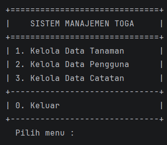

### Menu Tanaman
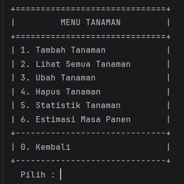

### Tambah Tanaman – Rempah
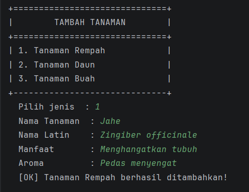

### Tambah Tanaman – Daun
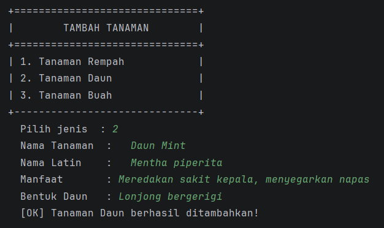

### Tambah Tanaman – Buah
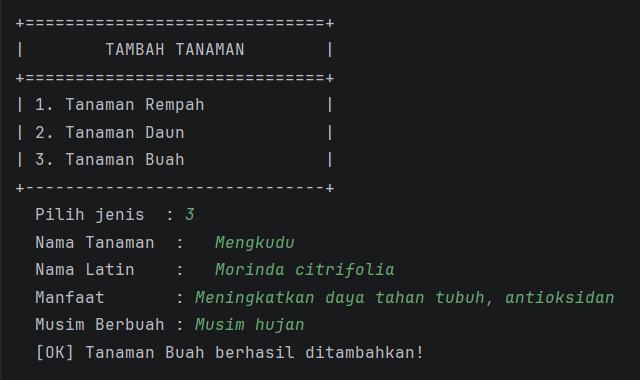

### Lihat Semua Tanaman
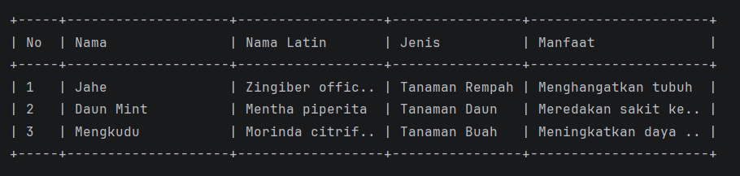

### Ubah Tanaman
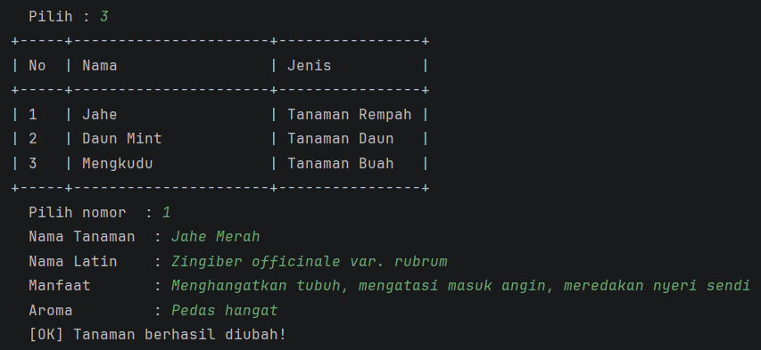

### Hapus Tanaman
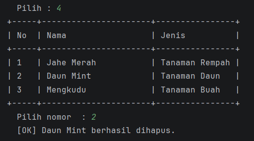

### Statistik Tanaman _(Bukti Method Overloading)_
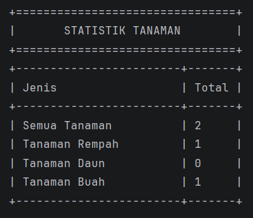

### Estimasi Masa Panen _(Bukti Method Overloading)_
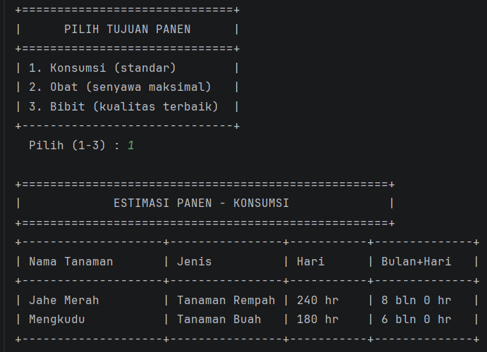
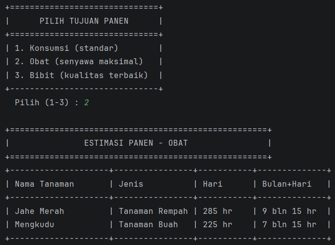
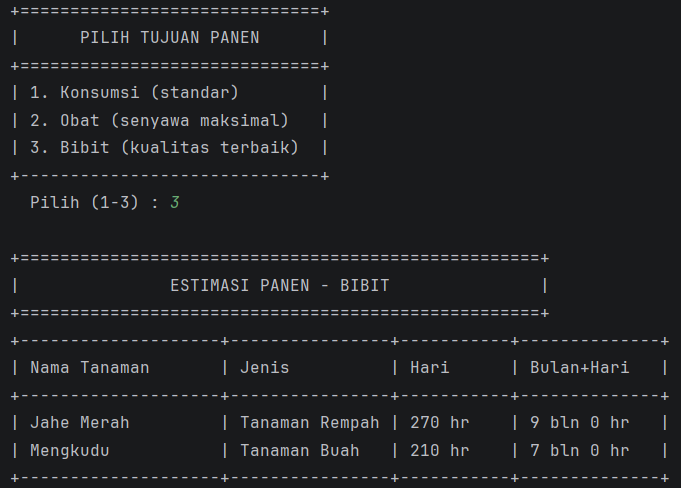

### Menu Pengguna
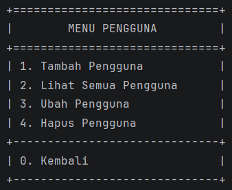

### Tambah Penguna
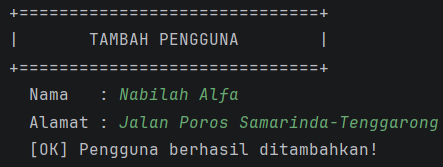

### Lihat Pengguna
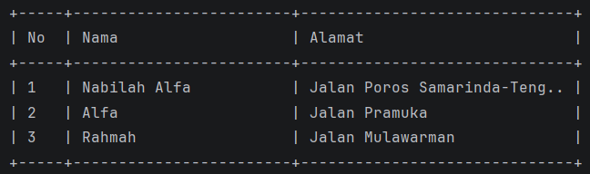

### Ubah Pengguna
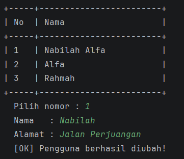

### Hapus Pengguna
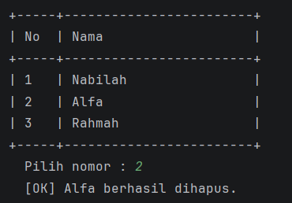

### Menu Catatan
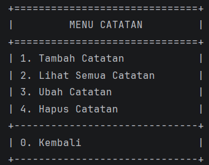

### Tambah Catatan
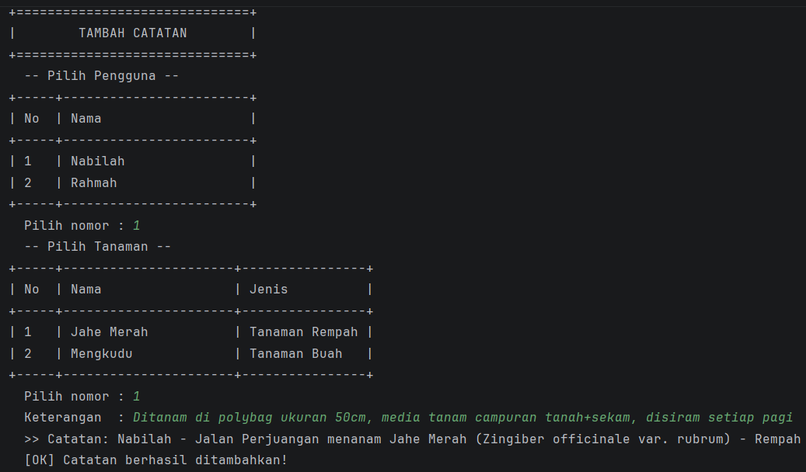

### Lihat Catatan
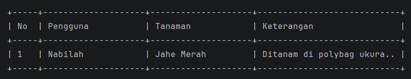

### Ubah Catatan
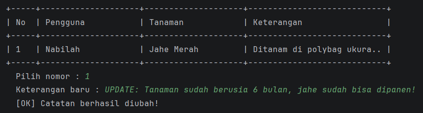

### Hapus Catatan
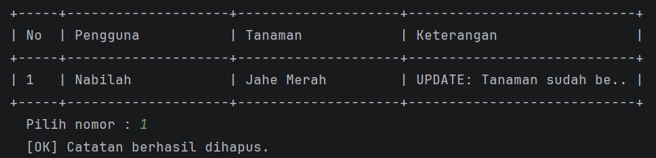

### Validasi Input Kosong _(Bukti Enkapsulasi)_
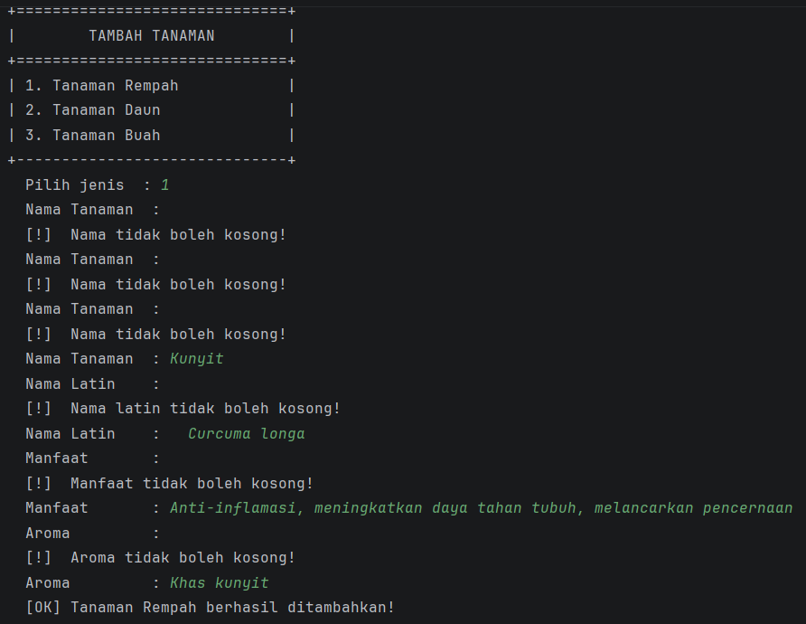

### Keluar Program
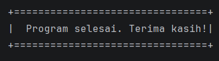